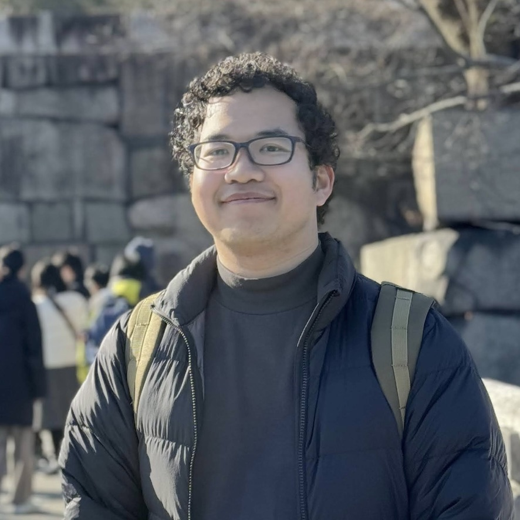

+++
date = '2026-05-02T18:01:51+09:00'
draft = false
title = 'Resume'
toc = true
+++

# All About Me

### Profile Summary

  
  <dl class="profile-info">
    <dt>Name</dt>
    <dd>Ouk Outdam អ៊ុក ឧត្តម オック　オドム</dd>
    <dt>From</dt>
    <dd>Cambodia</dd>
    <dt>Hobbies</dt>
    <dd>Programming, Photography, Listening to Music</dd>
    <dt>Research</dt>
    <dd>Machine Learning, Speech Recognition, Para-linguistic Analysis</dd>
  </dl>

#### Introduction

Hello, my name is Outdam. I'm currently pursuing a Master's degree in Computer Science and Engineering at Toyohashi University of Technology. I'm deeply interested in all things related to computers and have a passion for learning across a wide range of topics. I enjoy solving problems with friends and collaborating on programming projects to explore new ideas and technologies.

#### Current Research

My current research focuses on applying machine learning to speech recognition, particularly in recognizing para-linguistic information to enable rich transcription. This involves developing systems that can capture not just what is said, but how it's said—including intonation, fillers worlds, laughter, and other non-verbal vocal cues that add meaning to human communication.

### Technical Skills

#### Programming Languages







#### Frameworks & Technologies






#### Tools & Platforms





### Human Languages





### Education






### Work Experience








### Extracurricular Activities









### Awards & Achievements






